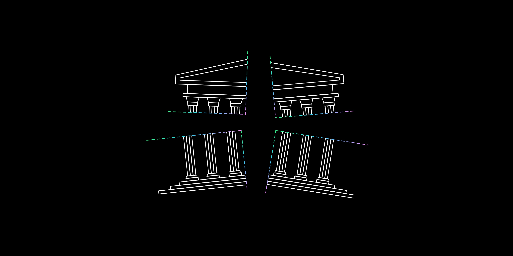

# DeFi Is Eating CeFi

Decentralised finance is nothing but a set of permissionless protocols that conduct financial services without the need of middlemen facilitating them. Think of each protocol as a set of lego blocks, and your account as the base block upon which you can add and remove whatever financial function you please.

Bitcoin was introduced as an alternative to fiat currencies, to act as “base money”, by servicing the following functions — unit of account, store of value, and medium of exchange. What led most of the excitement within the community wasn’t just the introduction of a functional sound money, but the introduction of the technology that enabled it. One that could disintermediate trust itself: Blockchain.

Builders in the space explored what such a system could enable, and the focus led to smart contracts. The simplest way to understand smart contracts would be to think of it as tamper-proof guaranteed code, which is executed as you would expect it to execute. What’s exciting about that? the fact that pieces of code that can run perpetually, are open, and cannot be changed is a strong primitive for functions that exist today (lending/borrowing, derivatives, legal agreements, time-stamping, storage, etc.), and newer functions that weren’t possible before (eg. Supply-elastic non-dilutive currencies like Ampleforth).

While Bitcoin was solving the problem of trust in money, Blockchain offered the means to solve the problem of trust in general. Smart contracts were the means here.

As the exploration and development of usecases around smart contracts began, the community was tilted towards financial applications as there was an aftertaste of Bitcoin that remained, a financial application. Moreover, what the technology dis-intermediated was trust, and financial services were full of it. So it only made sense that it would be the first target for the space to swallow.

While Bitcoin, its clones and similar currency tokens tried to serve the purpose of money, functions around said money were missing. At the end of the day, money is only as useful as what you can do with it.

Which brings us to DeFi, or Decentralised Finance. As demand for crypto-assets grow, builders in and out of the space are realising the value of smart contracts, and their potential to serve crypto-assets by building financial applications in a decentralised manner, in the spirit of the asset-class itself. DeFi is nothing but a set of decentralised, immutable protocols that conduct specific financial functions, from lending and borrowing to insurance and basic transactions. To understand DeFi we must first demystify CeFi, or Centralised Finance. Centralised institutions conduct most financial functions today:

- Central Banks — Money, financial regulation.
- Commercial Banks — Lending, borrowing, savings.
- Investment Banks — Derivatives, financial contracts.
- Exchanges — Market operations.
- Brokers — Trading.
- Insurance companies — Risk protection.
- Payment Gateways — Transactions.

I call DeFi the “Financial Operating System” or FOS. While the Financial System is built on legacy infrastructure with no means to update, blockchain + smart contracts turns this archaic system into an operating system of sorts, one that is programmable and composable.

As everything gets digitised and automated, it’s only a matter of time until we see the functions mentioned above face the same fate. The foundational technologies and architecture required to make that vision a reality is already here, and the minds needed to implement said vision are heads down working tirelessly.

*Ask yourself this:*

Would you want to save money, trade stocks, buy property, get insurance, make transactions, lend money, with the permission of a centralised corporation that can change or shut down at any moment, a centralised corporation that risks your money for their benefit, a centralised corporation that charges you fees and sets restrictions on money you’ve earned,

*OR*

a permissionless, transparent ledger run by immutable code and governed by a network whose incentives are tightly aligned to protect said ledger?

I’d personally pick the latter. Unlike CeFi, DeFi also enables unparalleled access to financial services, accessible from anywhere, at anytime, with just an internet connection.

Let’s go deeper into the functions mentioned above with examples of CeFi institutions as compared to their “protocolised” counterparts. While looking at these alternatives, keep in mind that they’re decentralised, governed by entities and people all around the world, not a single corporation. Some of them are even governance-free, meaning they never change, enabling you to have confidence on the services you use.

#### Money

While money is traditionally issued by central banks, in DeFi its issued by either a company, non-profit foundation, DAO (Decentralised Autonomous Organisation), or an individual. What separates money issued here from its traditional counterpart is that its governed either in a decentralised manner by those whose interests are aligned with said money, or in a completely automated way with self-enforcing code.

Centralised: ``Dollar, Euro, Pound, Rupee.``

Decentralised alternative/s: ``Dai, Bitcoin, Ether, Ampleforth, etc.``

#### Central Banks

While central banking is exclusive to the traditional financial system, DeFi doesn’t require it. In most money protocols, the functions that a central bank would traditionally conduct are self-enforced by the code. Although, in protocols where there’s a need for external governance, monetary policy functions are conducted by DAOs or Decentralised Autonomous Organisations.

Centralised: ``Federal Reserve for the Dollar, Reserve Bank of India for the Rupee, Bank of England for the Pound.``

Decentralised alternative/s: ``MakerDAO for DAI, Reserve for RSV, Meta for mStable.``

#### Commercial Banks

Centralised: ``Bank of America, Wells Fargo, Citigroup, HSBC.``

Decentralised alterative/s: ``Compound, Bzrx, Aave, Dharma.``

#### Investment Banks

Centralised: ``Goldman Sachs, JP Morgan, Deutsche Bank, Morgan Stanley.``

Decentralised alterative/s: ``Synthetix, UMA, Dydx, Polymath.``

#### Exchanges

Centralised: ``NYSE, NASDAQ, CBOE, NSE.``

Decentralised alterative/s: ``Uniswap, 0x, Curve, Synthetix.``

#### Brokers

While the functions of exchanges and brokers are independent of each other in the centralised world of finance, DeFi doesn’t separate the two. Trade takes place directly on the exchanges. Although the closest entities to brokers in DeFi would be relayers and interfaces.

Centralised: ``Robinhood, eToro, Charles Schwab, Fidelity.``

Decentralised alternative/s: ``Zerion, Zapper, Matcha, 1inch.``

#### Asset Management

Centralised: ``Blackstone, Blackrock, Vanguard.``

Decentralised alterative/s: ``Yearn, Melon, Set Protocol.``

#### Insurance

Centralised: ``Geico, AXA, State Farm, Allstate.``

Decentralised alternative/s: ``Nexus Mutual, yInsure, Opyn.``

#### Payment Gateways

Centralised: ``Stripe, Paypal, Square, Venmo.``

Decentralised alternative/s: ``Metamask, Argent, Coinbase Wallet, and literally just your address.``

## Composability

One of the greatest advantages of using DeFi is its composability. Composability is nothing but the interconnectedness between the services/functions you use with other services/functions. Due to the simple nature of every function running via smart contracts which all use the same formatting (in terms of addresses and code) and lie on the same layer, they get to interact with each other seamlessly.

The simplest analogy to composability would be Legos. Think of DeFi protocols as a set of Lego blocks, with each block serving a specific function or purpose. As a user of DeFi, you you would have your account/address block, which would be your base, on top of which you would be able to add whatever functions you’d like to perform on your money. Every protocol on a blockchain can interact with any other protocol, with no limits whatsoever.

In comparison, CeFi would be best analogised as a set of walled gardens, where each function or service offered by different companies (instead of protocols) are walled off from each other keeping you from seamless interoperations.

## Governance

What makes DeFi decentralised is its control and distribution. The control aspect is what leads us to the question of governance and how protocols and projects are updated if they aren’t owned by any single entity, unlike a basic application you’d find on the app store. Most protocols in the space don’t need any governance as they’re “governance-free”, meaning that they don’t require external interference for them to function. They run completely on self-enforcing code (I.e. smart contracts). But those that do require external interference have modules attached to said smart contracts that enable individuals and entities to govern within the limits of certain rules hardcoded into said modules. The most commonly used governance module comes in the form of a DAO or Decentralised Autonomous Organisation. DAOs are nothing but digital entities (similar to organisations in the physical world) that enable a network of its participants/members to facilitate decision making formally. Examples of protocols using DAOs: Compound and Synthetix.

## Permissionless

As a result of most protocols being open, governance-free and decentralised, they allow for permissionless access. Meaning, anyone from anywhere can access it at any time without any prior approval, unlike all of CeFi.

While it’s early to speak on DeFi “eclipsing” CeFi, all signs point in that direction. With the digitisation and automation of everything, finance is one space that hasn’t updated itself in a long time. Fintech has been trying to bring the financial system to the 21st century, with the unfortunate need to build on archaic foundations. DeFi ditches these foundations and builds on entirely new ones. Foundations that fit the time we’re in.
