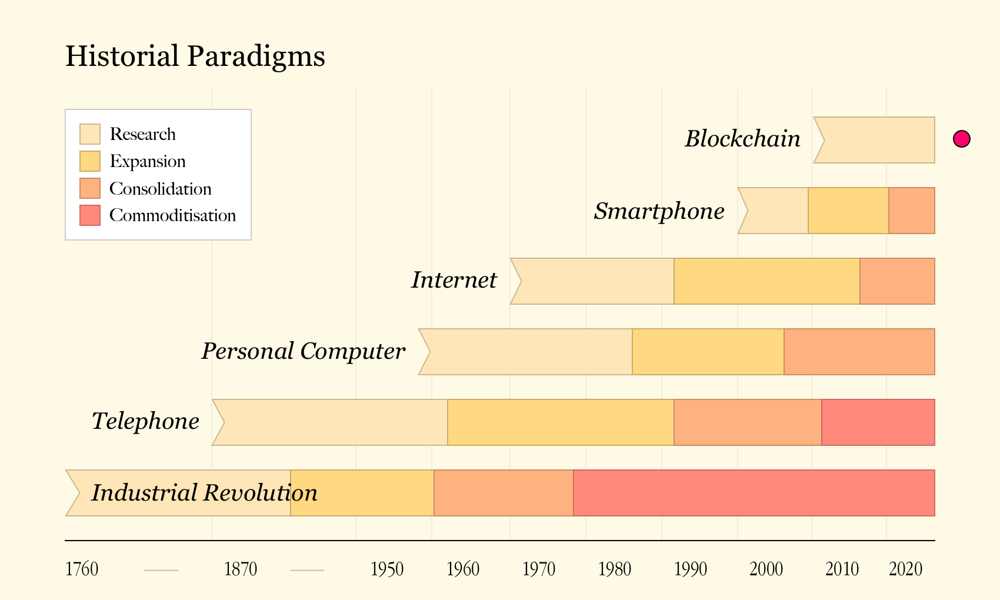
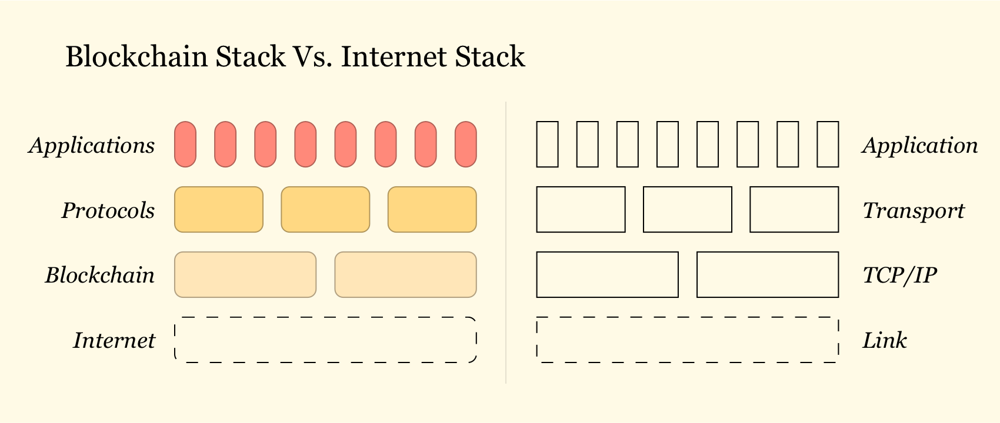
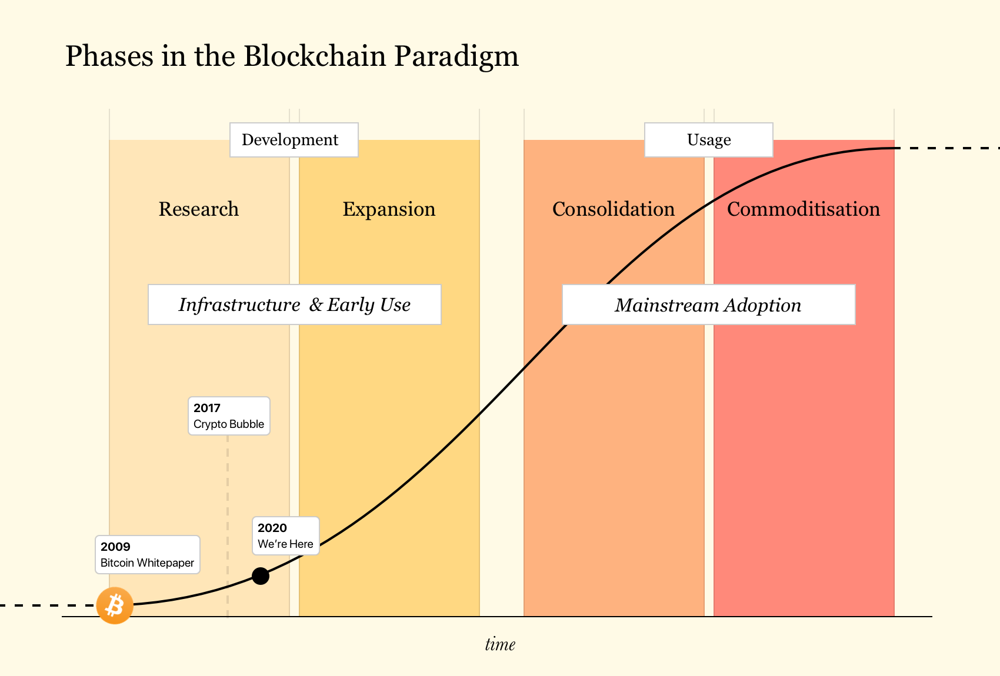
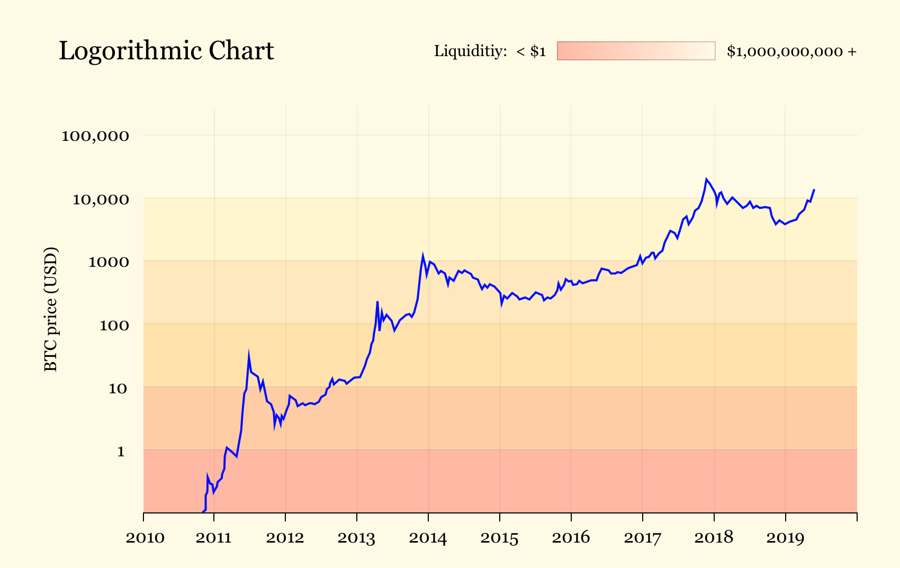

# Investing in a Paradigm Shift

Abstract: Bitcoin’s underlying technology, Blockchain, solved the problem of trust, opening the floodgates to crypto-based alternatives to entire industries, systems and functions. This disintermediation, like any other in the past, leads to a paradigm shift, enabling investors who participate early to benefit magnitudes over any other traditional asset class.

## Introduction

With the introduction of a paper titled “Bitcoin: a peer-to-peer cash system”, a pseudonymous entity going by the name Satoshi Nakamoto, solved a problem that computer scientists and economists have been trying to solve for decades. A problem titled the “Byzantine Generals Problem”, which analogises Trust. This problem has entailed all of human cooperation, which is why applications on the internet were limited. Even within this limitation, the internet flourished, encompassing the entire planet with applications solving trillion dollar problems. Now for the first time ever, previous impossibilities have opened up in relation to every application and use-case entailing trust. This leads us into a new paradigm, which most layman are blind to or pessimistic about due to the current perception of the industry.

As speculation in digital assets peaked with all the hype created around blockchain technoology in 2017, scams became prominent, taking advantage of the newly borne gold rush. Since most assets within the industry were overpriced, due to a lack of any intrinsic value created in that same period resulted in the negative perception of cryptocurrencies and blockchain in general. This was a result of most headlines linking the technology to one scam or another. This does not come as a surprise to those who have witnessed paradigm shifts, as in their early days any paradigm attracts its own set of scammers due to the inflow of new capital.

## The opportunity

All this attention led to a boom in interest from developers, scientists and researchers, with hordes of talent coming into the space to build problem solving products. These developments are dis-intermediating or completely replacing functions performed, products offered, and services rendered by existing companies and industries, let alone build new products that would not have been possible without the technology. Every time an innovation enables the disintermediation of existing industries and traditional ways of doing things, it’s considered a paradigm shift. A few notable paradigm shifts were Electrification, the Telephone, the Personal Computer, the Internet, the Smartphone, and now the Blockchain. And managing to catch a paradigm shift while it’s happening has historically proven to be extremely profitable. Entire funds have been built on the shifting of paradigms: Sequoia Capital and Accel Partners for Personal Computers, Andreeson Horowitz for the Internet, and Pantera Capital for Digital Assets.

Andreeson Horowitz in their thesis for crypto wrote: “Trust is a new software primitive from which other components can be constructed. The first and most prominent example is digital money, made famous by Bitcoin. But, as we’ve discovered over the past few years, many other software components can be constructed using the building blocks of trust. Smart contract platforms like Ethereum enable the creation of, among other things, application-specific currencies, digital property rights, open financial instruments, and software-based organizations.”

Ethereum, a blockchain platform (Backed by the currency Ether), was one of the fastest growing open source projects in 2018, based on developer activity. With Ethereum being just one example, the number of projects in the space focussing on the function of currency has shifted drastically to applications solving actual problems and replacing their traditional counterparts. This shows that the industry (similar to the Internet after the Dot Com Bubble), is moving from Speculation to Utility. To understand these developments, we must understand the blockchain stack, which is quite similar to the Internet stack. Understanding this stack will also enable us to see what the state of crypto is and why it is that way.

Similar to other paradigm shifts in their early days, blockchain and its offerings come with a lot of complexities. This is a result of the development currently consolidating in the lower layers of the stack. Once focus moves to the upper layers, the technology and projects built on it become more usable, resulting in the inflow of users, capital and liquidity. Just as the web and browsers paved the way for TCP/IP to mass adoption by establishing standards that enable interoperability for the internet, we believe that development on the upper layers of the blockchain stack will pave the way for blockchain protocols to mass adoption. The day will come when crypto addresses are as commonplace as email addresses are today, and we will use them for everything from receiving income, to sending messages, and managing investments.

The “Why” of these protocols and the success of blockchain lies in the following comparison: Math vs Trust. As solutions from blockchain technology become more accessible and usable, users will have alternatives to products that underly a middleman or some layer of trust. Most protocols and applications in the crypto space are self-enforced, without the need of any third party maintaining it. This abstraction of the middleman enables applications to become fully “trust-less” and extremely secure, in the sense that they perform exactly as they are built. For example, finance required third parties and middlemen like banks to maintain records, assets, etc. in order for it to function. But now with the help of smart contracts, banking can be completely machine run and automated. This is just one example, out of many that enable the abstraction of trust.

## Fallacies

1. Only use-case is currency.
2. No intrinsic value.
3. Unregulated.
4. It is Hackable.
5. Only for illegal activities.

## Approach

The best way to take advantage of any new paradigm is to ride on its foundational opportunities, ones that aren’t visible to the layman. These foundational opportunities only remain as development consolidates in the lower layers of the stack. Being present in the early days of this paradigm enables us to make these investments. These lower level protocols and platforms act as foundations to applications being built upon them, just as TCP/IP acts as a foundation to applications like Google and Facebook. At the same time it would be a mistake to ignore investment opportunities on the application layer, those that are taking advantage of the benefits offered by this new technology.

Understanding the drivers of supply and demand is key to developing a long-term investment strategy. Most of the growth we’re experiencing today is driven by the supply side of the market. Bitcoin and Ethereum’s financial success combined with diminishing returns on the web are pulling more and more entrepreneurs and investors away from consumer web and into crypto. By no means is it trivial to design, deploy and scale a functioning crypto-network, but it’s so much cheaper than trying to compete with the likes of Google, Apple, Facebook and Amazon, and the potential returns so astronomical that the rush is almost inevitable. This inflow of talent leads to the inception of products that take advantage of this new paradigm to the fullest and enable the potential returns for investors in them to be astronomical as well. The space is attracting an influx of new capital and talent, but the market is still immature, and the opportunity remains fresh. Despite the liquidity of crypto assets, underlying products and teams more closely resemble the profile of a risky and volatile seed stage startup than a publicly traded company. This is what enables venture economics at market liquidity.

The chart above represents the price of Bitcoin logarithmically, the way it should be looked at. Pricing and volatility change with the change in liquidity for said asset.

To understand our investment schema, we must understand asset classification in the space:

1. **Utility tokens** — Digital assets backed by some utility or function underlying it for it to work.
2. **Currency tokens** — Digital assets reliant on its demand and supply.
3. **Security tokens** — Digital assets backed by or pegged to real world assets.

The rise in the development of new use-cases and applications in the space, entails the creation of tokens backing those developments. Many people falsely believe in the narrative “Blockchain not Bitcoin”, meaning that the technology underlying it has value, but the currency overlaying it is worthless. A blockchain or blockchain-based protocol without its own token is just an excel sheet distributed amongst computers. The currency is what brings in what’s called “crypto-economics”. This is the foundation of any protocol or platform in the space. The tokens backing these protocols are utility tokens as they back certain utility, which we call “function disruptors” or “function creators”, as they either (1) replace existing functions or (2) create functions that were not possible before the introduction of the technology. With the internet economy encapsulating the physical economy, protocols and functions such as these become absolutely necessary.

Currency tokens on the other hand, are digital assets that are purely based on the economics of their network and the demand and supply for said tokens in the open markets. These tokens are extrinsically backed by their network effects just like any other currency. Let’s understand this concept with the US Dollar as an example. The dollar was taken off the gold standard with the “Nixon Shock” and yet we see the dollar act as the global reserve currency and standard of exchange. This is a result of its network-effects. Network-effects is defined as “the effect described in economics and business that an additional user of goods or services has on the value of that product to others. When a network effect is present, the value of a product or service increases according to the number of others using it.”

Security tokens, in simple terms, are digital securities backed by real world assets. Think shares in a company, REITs on a property, securities backed by commodities, etc. They are just traditional securities, wrapped in the form of blockchain-based tokens.

Each category comes with its own set of characteristics, requiring us to maintain independent research methodologies for each. For example, a utility token would require us to focus on the functions they perform, the value said functions create and their underlying network-effects. Whereas, a security token would require us to fundamentally research its underlying asset.

## Sub-Theses

1. Venture economics with market liquidity.
2. Piggybacking on digitisation and automation.
3. Hedge against traditional assets.
4. Inter-connected Finance.
5. More regulations. More order. No longer the wild west.
6. Intrinsically valuable use-cases.
7. Software eating the world.
