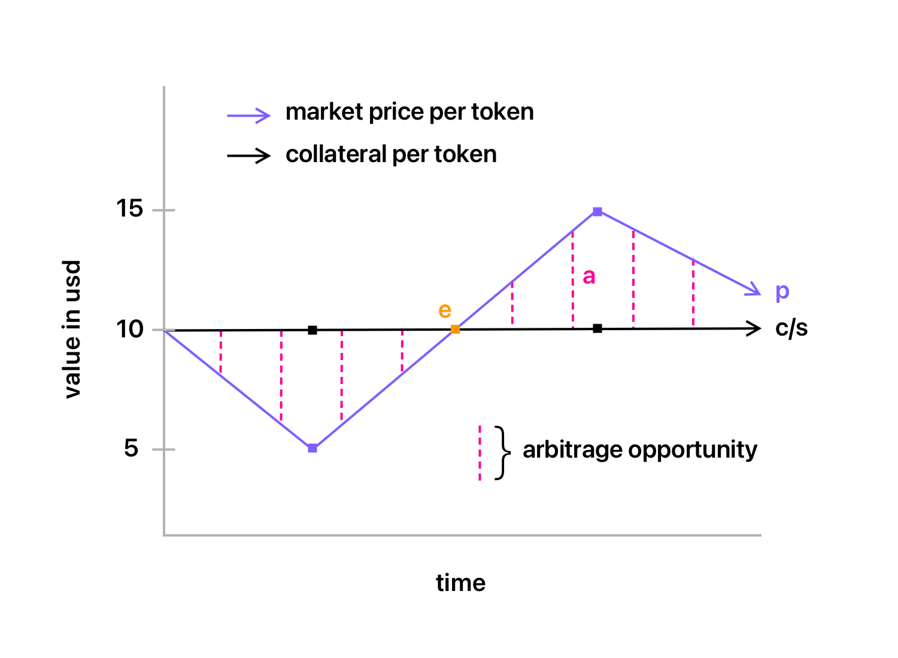

# Non Fungible Bonds

## Introduction

> #### TL;DR: NFTs + Bonds

This paper introduces a new primitive in NFTs: The Non Fungible Bond, or NFB. Non-Fungible Bonds offer floor price protection and yield generation opportunities to their holders, while allowing issuers to avail term-based capital.

While the primary purpose of a minimum viable NFT (Non Fungible Token) is to represent ownership of a tangible or intangible asset that cannot be replicated or divided (making it ‘non-fungible’), NFBs add a layer of liability and maturity. Unlike traditional NFTs, where the initial sale of the NFT ends the financial relationship between the issuer and the holder of the token, NFBs maintain the financial relationship until the stipulated period of maturity, similar to traditional bonds.

### NFTs

Non Fungible Tokens or NFTs act as a new distribution mechanism for assets, storing proof of ownership on decentralised networks instead of centralised registries. As of today, they have most commonly been utilised in distributing art. In 2021 alone, art-based NFT sales volumes topped $25 Billion. While its monetary success is undeniable, the mechanism has been majorly limited to a single asset class. Further to this, the sale of such tokens have been limited to primitive means with minimal innovation.

### Bonds

We’re all aware about bonds and their mechanics, instead, we will focus on their digital counterpart - *smart bonds*.

When referring to smart bonds or blockchain-based bonds, it is assumed that they are fungible in nature. As a mechanism, smart bonds are yet to take off, even though primitives such as smart contracts and distributed systems make for the right combination for bond issuances: A smart contract with the bond’s terms hard-coded along with securing the collateral, combined with a token contract that complies with ERC20-like standards would make for an ideal bond issuance. Although we have yet to see this combination gain footing, over time they are bound to gain transaction.

While smart bonds of the fungible kind have been discussed and implemented in the past, nothing has been written about their non-fungible counterpart.

## Motivation

### The Floor Price Problem

As a result of the illiquidity and subjectivity in most assets underlying NFTs, they don’t maintain a floor price that can reasonably be valued or ascertained. This has led to uncertainty and volatility in pricing such assets. While the general liquidity flowing into NFTs has proven that the market for such a primitive is growing, it is yet to give market participants logical pricing schemas.

### The Maturity Problem

Most tokens today, be it fungible or non-fungible, operate in perpetuity, with no function of expiry or maturity. Further to this, most tokens come with no integrated terms of obligation to be fulfilled.

### The Fungibility Problem

While bonds generally tend to be fungible, there are structures and issuances that would require non-fungibility. An example: An issuer wants to create bonds using time-based tiers to incentivize early contribution, where earlier participants in the bond issuance can avail favourable terms relative to those that come in later. This would require the bonds to be non-fungible and split into different classes to represent time ranges.   
‍Other examples:  
(i) Differing assets attached (eg. different JPEGs for every token).  
(ii) Differing maturity periods. 
(iii) Differing yield. 
(iv) Differing entry/exit points.

## Mechanism

The three problems mentioned above are why we have to classify NFBs independent from other forms of NFTs (equity, art, collectibles, etc.). Unlike traditional NFTs, NFBs come with an obligation attached to it and a specific period of time the obligation is enacted. While overlaying assets (such as JPEGs or collectibles) may continue in perpetuity with the token, depending on the terms initially agreed upon, the underlying bond (financial obligation) expires upon maturity/fulfillment.

### Components

1. *Issuer* - The party that issues the bond and holds responsibility in fulfilling the obligation/s.

2. *Holder* - The party that holds the bond, in turn being the beneficiary of the obligation.
‍
3. *Market Price* - The price ascertained by the market at any given point in time for a single unit.
‍
4. *Floor Price* - The lowest price one must pay to be able to acquire a token in the collection.
‍
5. *Collateral* - Assets that secure the bond obligation.
‍
6. *Maturity* - A specific point in time the bond expires, ending the obligation/s of the Issuer to the Holder.
‍
7. *Interest* - A payment/premium paid to the Holder, usually calculated over the face or par value of the bond. This can either be paid out in regular/irregular intervals or upon Maturity.
‍
8. *Token* - The economic unit that represents the bond. This can either be transferable or non transferable, depending on the terms agreed upon.
‍
9. *Terms Contract* - The agreement/contract stipulating all the terms and obligations pertaining to the bond. This can either be (a) automated or (b) fulfilled manually.
‍
10. *Enforcement* - Depending on whether the obligation is fulfilled automatically or manually, the enforcement can be carried out (a) digitally using smart contracts with recourse reliant on code, or (b) physically using old fashioned contracts with recourse reliant on jurisdiction-based court systems.

### Price Stabilisation

Adding a layer of bond-like mechanics would act as a means to dampen the volatility. This allows participants to maintain confidence in a relatively more stable floor price - one that is attached to a collateral or obligation. It goes without saying that bonds are financial instruments and should only be used when appropriate.

By the virtue of there being an obligation towards the holder of an NFB, the market is expected to price it in depending on certain considerations:  
(i) Likelihood of repayment.  
(ii) Issuer track record.  
(iii) Liquidity.  
(iv) Exogenous conditions (Eg. interest rates).

#### Example A

Let’s assume price per unit as `p`; total supply of units as `s`; collateral as `c`; and arbitrage spread as `a`. The arbitrage spread will be represented as: `a = (c/s) - p`. Where a acts as the premium (if `a` >0) for market participants to take advantage of, and in turn, close the gap between the two variables: `p` and `c/s`. The point at which `p` and `c/s` meet is the point of equilibrium, represented as `e`.

Imagine an NFB issued with over 1000 units at the price of $10 per unit (giving it a market capitalization of $10,000), secured by a relatively stable collateral of $10,000 held in an address on-chain. This means that the collateral posted backs each unit by $1 at issuance. Let’s say that changes in macro conditions switch the market’s bullish stance into a bearish one, leading to a severe drawdown. As a result of poor liquidity, some NFB holders sell at price disconnected from endogenous variables, and bring the overall floor price of the collection down to $5. Ceteris paribus, this change in market price has had no impact on the collateral, creating a masked arbitrage opportunity worth $5 per token.

### Implementation Example

For the purpose of illustrating this concept, rather than using theoretic examples, we have implemented a working product that can be found here: ▙▜▝▟▗▞▜▚▝ (link will be revealed soon).
