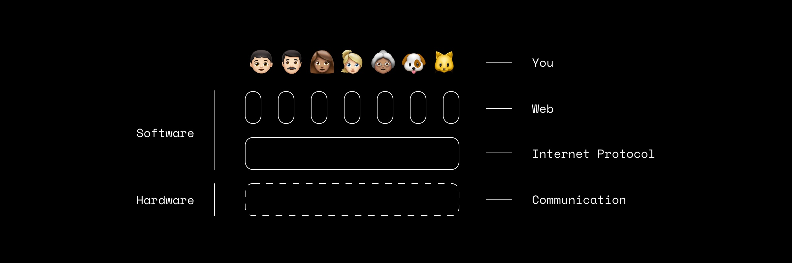

# Web 3.0

Web 3.0 is where the web is headed. A network of participants that can trustlessly interact with each other without the need of third party intermediaries. Where Web 2.0 was read-write, Web 3.0 is read-write-own.

When the internet was being established as a generalised network to facilitate communication by government agencies, universities and research organisations — engineers took notice. Upon realising what an openly accessible network that spans the globe offered, entrepreneurs from outside the bubble came in. As building on the Internet (Technically the Internet Protocol or IP) directly wasn’t possible, inventors like Tim Berners Lee introduced protocols like the World Wide Web (WWW) which sat on a layer above IP. This gave birth to what we call the web today.

It’s important to understand that the Internet and the web are NOT the same. One sits over the other, as represented in the illustration below.

## Web 1.0: Beginnings

> ### tldr; read only

Early days of the web brought us the concept of websites where people could put up content of any kind in the form of pages. These pages were accessible to anyone anywhere in the world who were a part of the network and had the unique identifiers (Technically URLs) of said pages. These URLs were just reserved spaces on the common network, which is why they were given the name web-‘sites’. This so-called “web” where people could host content, although revolutionary, came with its own set of limitations:

Only content: creators could only put up content; no software.
One way: users could only consume content and not share it.
Like paper: content was static.
As this network grew, the foundational infrastructure (the network layer which facilitated IP) like satellites, wires, towers, etc. was being consolidated by telecom companies. And the layer above (WWW) was still hosted ‘locally’, meaning that websites and their underlying data were stored with the creators of said websites in a siloed manner.

In simple words, at this point: *Data is centralised, the storage of the data is centralised, and the communication of said data is centralised as well.*

## Web 2.0: Currently

> ### tldr; read-write

This phase of the web enabled a notable shift towards user participation. Rather than users being limited to ‘read’ only capabilities, they could now ‘write’.

This iteration of the web enabled software over the web, rather than just basic content. This was a result of improvement in protocols, and their enablers like browsers, operating systems, etc. One popular software category that took off on the web was social networking.

Social networking is what enabled the capability of users to interact with the network, let alone just consume from it. Protocols like Email, and Platforms like MySpace, Facebook, YouTube, etc. became the norm. As content on the web was now majorly contributed by the users of websites and not the creators themselves, there needed to be a shift from siloed, centralised storage to decentralised hosting, where users hosted their own data. But that’s not what happened. Users did contribute the data, but the data was still held by the creators of websites. All while the users didn’t realise the consequences of it.

Think of hosting as the concept of custody. If you hosted your data, it would be considered self custody, just like how it would be if you held your cash instead of keeping it with a bank. But the convenience of keeping your cash at the bank outweighed any reasoning of consequence. This is what happened in Web 2.0.

Which means that users didn’t control the data they offered. Websites host their data for them. And so, users were expected to abide by their Terms & Conditions (T&C) or they’d be disallowed from the website. Not to mention, the website can change their T&C at anytime forcing the user to agree or be cut off from the service and, in some circumstances, their own data.

In simple words: *Data is decentralised, the storage of the data is centralised, and the communication of said data is centralised as well.*

## Web 3.0: Where we’re headed

> ### tldr; read-write-own

While the second iteration of the web relied on users to offer data which the host would reap the benefits of, the third iteration would transfer the benefits back to the users. In most cases, with Web 2.0, you as a user had little to no control over your own data as mentioned above. Furthermore, you never knew if the services, software, and programmes you enjoyed using would stick around.

Web 3.0 is solving this. Not just is this iteration solving centralisation brought about by the web, but solving centralisation in most industries.

Most Web 3.0 applications are referred to as DApps (or Decentralised Applications), which are built on peer-to-peer networks like IPFS and Ethereum. What makes them decentralised is:

1. *The decentralised nature of governance they follow* — They’re self-organizing, meaning that the users that use these applications have power over what happens to said applications. Once deployed on their respective platforms, they’re open to the world. This is quite similar to the governance structure the internet follows.

2. *The decentralised nature of the platforms they lie on* — Instead of being run by some central authority like a company, these networks are built, operated, and maintained by network runners, or in technical terms ‘nodes’. They’re self-organizing and lack a single point of failure.
Unlike websites built and hosted on siloed servers, DApps are built and hosted on these networks, via smart contracts. And another benefit these DApps achieve as a result of being on one common network is ‘Interoperability’. Interoperability is the ability for any function to be able to interact with any other function, even if they are on different applications.

Smart contracts are like pieces of code that run on blockchain-based networks. Once deployed, they operate as programmed where users can rely on them to be unstoppable and censorship-resistant.

In simple words: *Data is decentralised, the storage of the data is decentralised, and the communication of said data is still centralised.*

But as a result of newer incentive structures and ways of coordination as a result of Web 3.0 (and the already growing accessibility to high fidelity devices), the foundational layer (where the communication happens) is ripe to be decentralised as well. The technology and the network of participants finally make the idea of a decentralised internet feasible.
